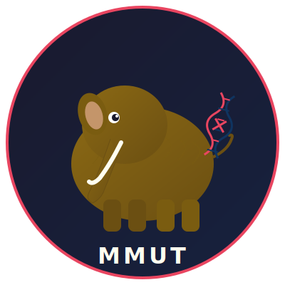

<p align="center">
  
</p>

<h1 align="center">MaLa/AI Maarke Unit Test (MMUT)</h1>

<p align="center">
  <em>Malai maarke test karo!</em> 🦣
</p>

<p align="center">
  A Claude Code skill that validates unit tests using mutation testing.<br/>
  It deliberately breaks your code in isolated worktrees and checks whether your tests actually catch the bugs.
</p>

---

## What's in a name?

**MaLa/AI** = ML/AI = **Malai** (मलाई — cream in Hindi)

Some people like their chai *malai maarke* (extra creamy). We like our unit tests *malai maarke* — rich, thick, and impossible to see through. If a mutation slips past your tests, they're too thin.

The **Mammoth** (🦣) is our mascot because MMUT sounds like mammoth, and like a mammoth, bad mutations should go extinct when your tests are strong.

## How it works

1. **Baseline** — Run your test suite. All tests must pass first.
2. **Identify** — Read each test and find the source code it exercises.
3. **Design mutations** — Pick 1-3 targeted code changes per test (negate conditions, swap operators, change return values, etc.)
4. **Dispatch** — Launch parallel subagents in isolated git worktrees, each applying one mutation and running the test.
5. **Report** — Generate a mutation score. Tests that don't catch mutations are flagged with concrete fix suggestions.

## Supported languages

Works with any language and test framework. Tested with:
- **Python** (unittest, pytest)
- **Node.js** (Jest)
- **Go** (go test)

## Result categories

| Result | Meaning |
|--------|---------|
| **KILLED** | Test caught the mutation — test is effective |
| **SURVIVED** | Test missed the mutation — needs improvement |
| **EQUIVALENT** | Mutation doesn't change observable behavior — not a test gap |
| **ERROR** | Mutation broke compilation/syntax — ignored in scoring |

## Installation

**From the Claude plugins marketplace** (once approved):

Use `/plugin` inside Claude Code to search for and install MMUT.

**Manual install:**

1. Clone the repo into the Claude plugins directory:

```bash
git clone https://github.com/jitendraag/mmut.git ~/.claude/plugins/mmut
```

2. Register the `local` marketplace in `~/.claude/plugins/known_marketplaces.json`:

```json
{
  "local": {
    "source": {
      "source": "github",
      "repo": "jitendraag/mmut"
    },
    "installLocation": "~/.claude/plugins/marketplaces/local",
    "lastUpdated": "2026-01-01T00:00:00.000Z"
  }
}
```

3. Create the local marketplace plugin registry:

```bash
mkdir -p ~/.claude/plugins/marketplaces/local/.claude-plugin
mkdir -p ~/.claude/plugins/marketplaces/local/plugins/mmut/.claude-plugin
cp ~/.claude/plugins/mmut/.claude-plugin/plugin.json \
   ~/.claude/plugins/marketplaces/local/plugins/mmut/.claude-plugin/plugin.json
```

4. Create `~/.claude/plugins/marketplaces/local/.claude-plugin/marketplace.json`:

```json
{
  "$schema": "https://anthropic.com/claude-code/marketplace.schema.json",
  "name": "local",
  "description": "Locally installed plugins",
  "owner": {
    "name": "Jitendra Agrawal"
  },
  "plugins": [
    {
      "name": "mmut",
      "description": "MaLa/AI Maarke Unit Test — validates unit tests using mutation testing.",
      "author": {
        "name": "Jitendra Agrawal"
      },
      "source": "./plugins/mmut",
      "category": "development",
      "homepage": "https://github.com/jitendraag/mmut"
    }
  ]
}
```

5. Add mmut to `~/.claude/plugins/installed_plugins.json` under the `plugins` key:

```json
"mmut@local": [
  {
    "scope": "user",
    "installPath": "/absolute/path/to/.claude/plugins/mmut",
    "version": "1.0.0",
    "installedAt": "2026-01-01T00:00:00.000Z",
    "lastUpdated": "2026-01-01T00:00:00.000Z"
  }
]
```

6. Enable it in `~/.claude/settings.json`:

```json
{
  "enabledPlugins": {
    "mmut@local": true
  }
}
```

7. Run `/reload-plugins` inside Claude Code to activate.

## Usage

Write some unit tests. MMUT triggers automatically when tests are written, or invoke manually:

> "Validate my tests" / "Are these tests good?" / "Run mutation testing"

After fixing tests flagged as weak, MMUT supports **incremental re-runs** — it re-validates only the previously-survived mutations without re-running everything.

## Requirements

- **Claude Code** with subagent and worktree support (Agent tool with `isolation: "worktree"`)
- A git repository (worktrees require git)
- Test runner installed for your language (pytest, jest, go test, etc.)

> **Note:** This plugin relies on Claude Code's ability to dispatch parallel subagents in isolated git worktrees. It is not compatible with platforms that lack subagent or worktree support.

## Score

```
Mutation Score = killed / (killed + survived) × 100%
```

Equivalent mutations and errors are excluded from scoring.

## License

MIT
