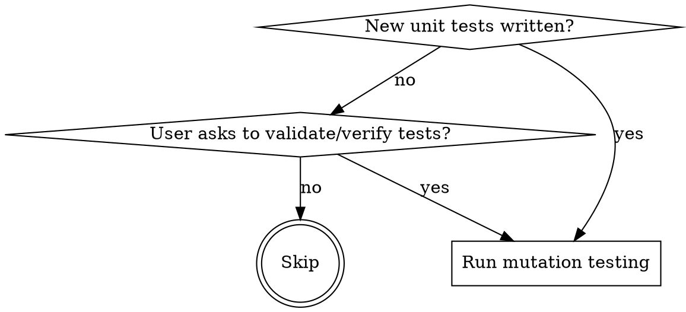
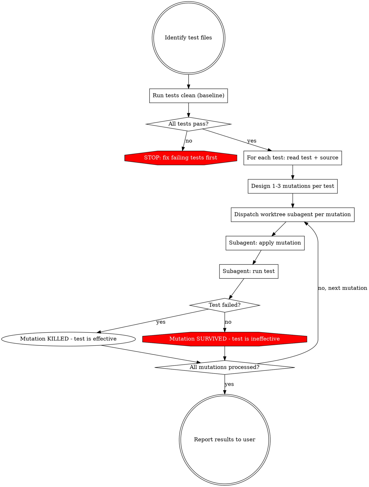

# Mutation Testing for Unit Tests

## Overview

**Core principle:** A test that never fails is worthless. Mutation testing proves tests are effective by deliberately breaking the code and verifying the test catches it.

For each test, introduce a targeted mutation into the source code in an isolated git worktree, run the test, and confirm it fails. If it doesn't fail, the test is ineffective — report to the user for refactoring.

## When to Use



**Trigger when:**
- Unit tests were just written (by you or the user)
- User says "validate tests", "verify tests", "are these tests good", "test effectiveness"
- After TDD cycle completes, to confirm test quality

**Do NOT use when:**
- Tests are integration/E2E tests hitting external services (mutations won't isolate cleanly)
- User explicitly says they don't want mutation testing
- The code under test doesn't exist yet (TDD RED phase — the test *should* fail)

## Core Process



### Step 0: Baseline Verification

**Before any mutations, run the full test suite in the clean working tree.** All tests must pass. If any test is already failing, stop — mutation testing on a broken baseline is meaningless. Fix failing tests first.

### Step 1: Identify Tests and Source

Read each test file. For each test function/case:
- Identify the source file(s) being tested (from imports, test file naming convention, or explicit reference)
- Read the source code to understand what logic the test exercises
- Determine the test runner command (check CLAUDE.md, Makefile, package.json, or infer from project structure — e.g., `pytest`, `jest`, `go test`)

**Test runner auto-detection:**

| Language | Detection signals | Test command | Build step |
|----------|------------------|--------------|------------|
| Python | `*.py` tests, `pytest.ini`, `setup.cfg` | `pytest` or `python -m unittest` | None |
| Node.js | `package.json` with jest/vitest | `npx jest` or `npx vitest` | None |
| Go | `*_test.go`, `go.mod` | `go test ./...` | `go build ./...` |
| Rust | `Cargo.toml`, `#[test]` blocks | `cargo test` | `cargo build` |
| Java | `pom.xml` / `build.gradle` | `mvn test` / `gradle test` | `mvn compile` / `gradle build` |
| TypeScript | `tsconfig.json` + jest/vitest config | `npx jest` / `npx vitest` | `npx tsc --noEmit` |
| Ruby | `Gemfile` + `spec/` or `test/` dir | `bundle exec rspec` / `ruby -Itest` | None |

Check for project config files (e.g., `Cargo.toml`, `pom.xml`, `package.json`) to auto-detect the language and test runner. Fall back to CLAUDE.md, Makefile, or user prompt if ambiguous.

**Scope limit:** Process up to **5 tests per batch** by default. If invoked via `/mmut --batch N`, use N instead. Report results after each batch and ask the user if they want to continue with more.

**Quick mode:** If invoked via `/mmut --quick`, use exactly **1 mutation per test** regardless of complexity, and skip equivalent mutation analysis. This provides faster validation at the cost of thoroughness.

### Step 2: Design Mutations

Choose **1-3 mutations per test** based on what the test claims to verify. Pick mutations that a good test *should* catch.

**Mutation strategies (pick the most relevant):**

| Strategy | Example | When to use |
|----------|---------|-------------|
| **Negate condition** | `if x > 0` → `if x <= 0` | Test checks boundary/conditional behavior |
| **Change return value** | `return True` → `return False` | Test asserts on return value |
| **Remove function call** | Delete `db.save(item)` | Test verifies side effects |
| **Swap operator** | `+` → `-`, `*` → `/` | Test checks arithmetic/computation |
| **Change constant** | `timeout=30` → `timeout=0` | Test depends on specific values |
| **Remove validation** | Delete input check block | Test verifies validation logic |
| **Empty collection** | `return results` → `return []` | Test checks non-empty results |
| **Remove error raise** | Delete `raise ValueError(...)` | Test checks error handling |
| **Boundary shift** | `<` → `<=`, `>=` → `>` | Test checks off-by-one boundaries |

**Choosing good mutations:**
- The mutation must be in code the test actually exercises
- The mutation should represent a plausible real bug (not absurd changes)
- Prefer mutations that change observable behavior, not internal state
- One strong mutation is better than three weak ones

**Avoiding equivalent mutations:**
- Before finalizing a mutation, verify it changes observable behavior. If the original and mutated code produce the same result for all reachable inputs (e.g., `x >= 1` → `x > 0` when x is always a positive integer), the mutation is *equivalent* — skip it.
- Common equivalent mutation traps: rounding changes on integer-only values, reordering independent statements, changing unreachable branches.

**Avoiding trivial mutations:**
- Don't pick mutations that any test would obviously catch (e.g., returning `None` when the test checks `assertEqual(result, 42)`). These produce KILLED results that give false confidence.
- A good mutation should be *subtle enough* that a weak test might miss it but a strong test would catch it.

**How many mutations per test:**
- **1 mutation** for simple tests with a single assertion or behavior check
- **2-3 mutations** for tests that claim to verify multiple behaviors or have complex logic
- When in doubt, start with 1 well-chosen mutation — it's more valuable than 3 weak ones
- **Quick mode (`--quick`):** Always 1 mutation per test, skip equivalent mutation checks

### Step 3: Dispatch Worktree Subagents

For each mutation, dispatch the `mutation-runner` agent with `isolation: "worktree"`. Independent mutations can run in parallel.

**Dispatch prompt for each mutation:**

```
TEST FILE: {test_file_path}
TEST FUNCTION: {test_name}
SOURCE FILE: {source_file_path}
TEST COMMAND: {command to run the specific test}

MUTATION TO APPLY:
{description of the exact mutation — what to change and where}
```

The `mutation-runner` agent handles git sync, mutation application, verification, build (if compiled), test execution, and result reporting. See `agents/mutation-runner.md` for full details.

Use the Agent tool with `isolation: "worktree"` for each subagent. This gives each mutation its own isolated copy of the repo — worktrees are automatically cleaned up when the subagent finishes without committing.

**CRITICAL:** Worktrees are created from an older commit. The subagent prompt includes a `git merge main --ff-only` step to fast-forward to HEAD. You cannot use `git checkout main` inside a worktree because main is already checked out in the primary worktree — always use `git merge` instead.

**Dispatch all mutations for a batch in parallel** — since each runs in its own worktree, they are always independent.

### Step 4: Report Results and Write Artifact

After all subagents complete, compile results and write a persistent artifact file.

**Result interpretation:**

| Result | Meaning | Action |
|--------|---------|--------|
| **KILLED** | Test failed after mutation | Test is effective for this behavior |
| **SURVIVED** | Test passed despite mutation | Test is ineffective — needs refactoring |
| **EQUIVALENT** | Mutation survived but doesn't change observable behavior | Not a test gap — skip in scoring |
| **ERROR** | Test couldn't run (syntax/import/compilation error) | Mutation was too destructive — ignore, does not reflect on test quality |

#### 4a: Write artifact file

Write a Markdown file to the project root: `mutation-testing-report.md`. This is the persistent record of what was done. Append to it if it already exists (add a new `## Run` section with the current date).

**Artifact format:**

```markdown
## Run {YYYY-MM-DD HH:MM}

**Tests validated:** {count}
**Mutations applied:** {count}
**Killed:** {count} | **Survived:** {count} | **Equivalent:** {count} | **Errors:** {count}
**Score:** {killed / (killed + survived) * 100}% (equivalent and errors excluded from scoring)

### Mutation Details

| # | Test | Source File | Line | Mutation | Result |
|---|------|-------------|------|----------|--------|
| 1 | test_foo | src/foo.py | 42 | Changed `return True` → `return False` | KILLED |
| 2 | test_bar | src/bar.py | 87 | Changed `x > 0` → `x <= 0` | SURVIVED |

### Survived Mutations (action needed)

#### 2. test_bar (`src/bar.py:87`)
- **Change made:** `x > 0` → `x <= 0`
- **Why it survived:** test_bar never asserts on the boundary condition when x == 0
- **Suggested fix:** Add this assertion to test_bar:
  ```python
  assert bar(0) == expected_zero_behavior  # catches boundary mutation
  ```

### Equivalent Mutations (no action needed)

#### 3. test_baz (`src/baz.py:15`)
- **Change made:** `x >= 1` → `x > 0`
- **Why equivalent:** x is always a positive integer in this context, so both conditions produce the same result
```

#### 4b: Print summary to user

After writing the artifact, print a concise summary to the conversation:
- Mutation score (killed / total as percentage)
- List only SURVIVED mutations with the suggested fix
- For each SURVIVED mutation, ask the user whether to refactor the test
- Link to the artifact file for full details

For each SURVIVED mutation, always ask the user before refactoring — they may have intentionally scoped the test narrowly.

## Quick Reference

| Phase | Action |
|-------|--------|
| **Identify** | Read tests, find source files, note test commands |
| **Design** | 1-3 targeted mutations per test based on what it claims to verify |
| **Dispatch** | Worktree subagent per mutation, parallel when independent |
| **Report** | Write `mutation-testing-report.md` artifact, print summary to user |

## Common Mistakes

**Testing the wrong layer:** Don't mutate code the test doesn't exercise. Read the test carefully to understand its scope.

**Trivial mutations:** Changing a comment or renaming a variable proves nothing. Mutations must affect observable behavior.

**Too many mutations:** 1-3 per test is enough. Focus on the highest-value mutations — changes that represent plausible real bugs.

**Mutating test infrastructure:** Never mutate the test itself, test fixtures, or shared setup code. Only mutate the source code under test.

**Forgetting isolation:** Always use worktree isolation. Mutating code in the main working tree risks leaving broken state.

## Incremental Re-run

If `mutation-testing-report.md` exists and contains SURVIVED entries from a previous run:

1. Read the report and identify SURVIVED mutations
2. Ask the user: "Found {N} survived mutations from the last run. Re-run just those to verify fixes?"
3. If yes, skip baseline verification (assume tests still pass) and skip the identify/design steps
4. Dispatch subagents only for the previously-survived mutations using the same mutation descriptions from the report
5. Update the report: change SURVIVED → KILLED for any mutations now caught, add a "Re-run {date}" section
